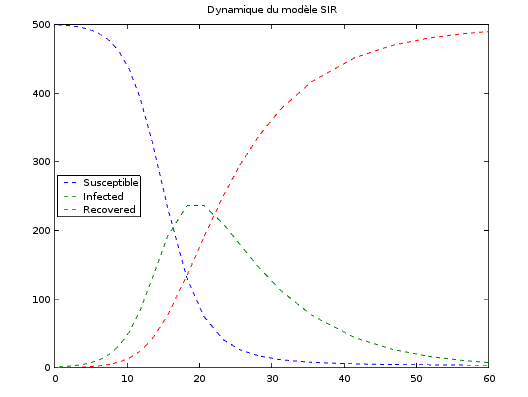

= Modèle épidémiologique SIR
Oxana USHAKOVA
:feelpp: Feel++
:stem: latexmath

== Intro 

Les modèles mathématiques de maladies infectieuses ont commencé à être mis en pratique avec le problème du SIDA dans les années 1980. Ces modèles se basent sur le même rincipe :  on divise la population en classes épidémiologiques tels que les individus susceptibles d'être infectés, ceux qui sont infectieux, et ceux qui ont acquis une immunité à la suite de la guérison. Cette approche est utilisée non seulement   pour modéliser de très nombreuses maladies, mais aussi dans l'étude de la science des réseaux.

== SIR

SIR : susceptible, infected, recovered - est un modèle très simple, à partir duquel on dérive des modèles plus complexes. SIR permet de modèliser la propagation de la rougele ou parotidite virale.

