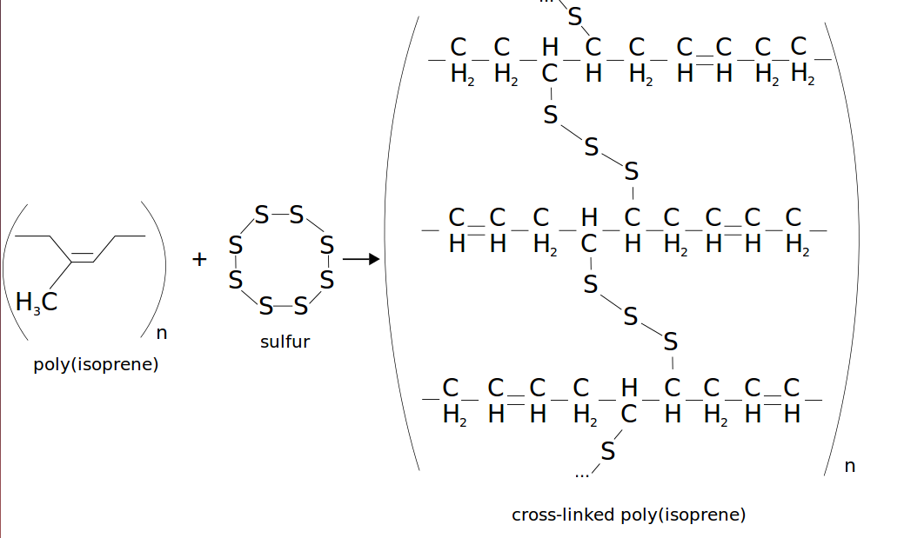
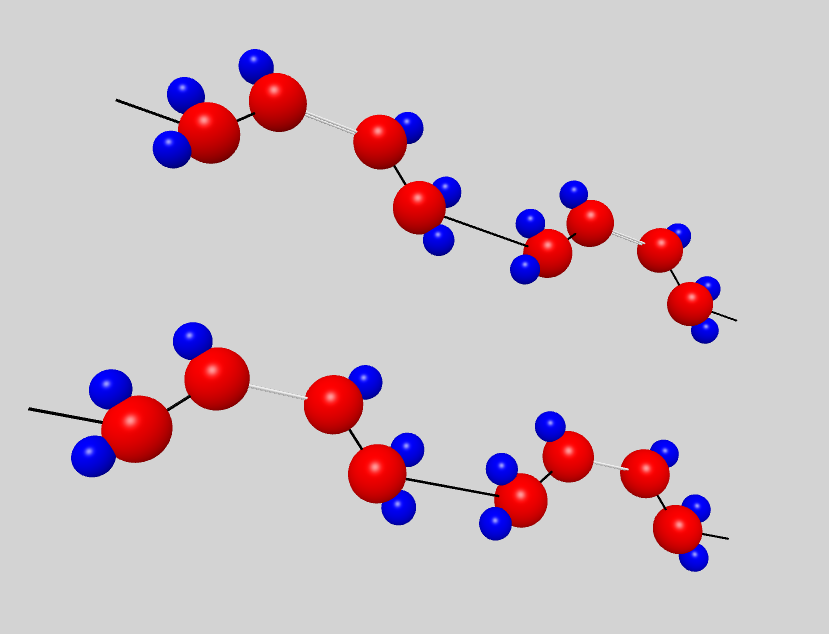
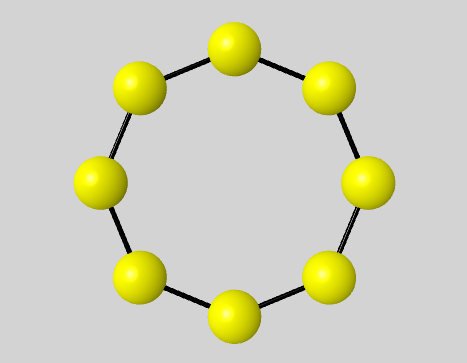
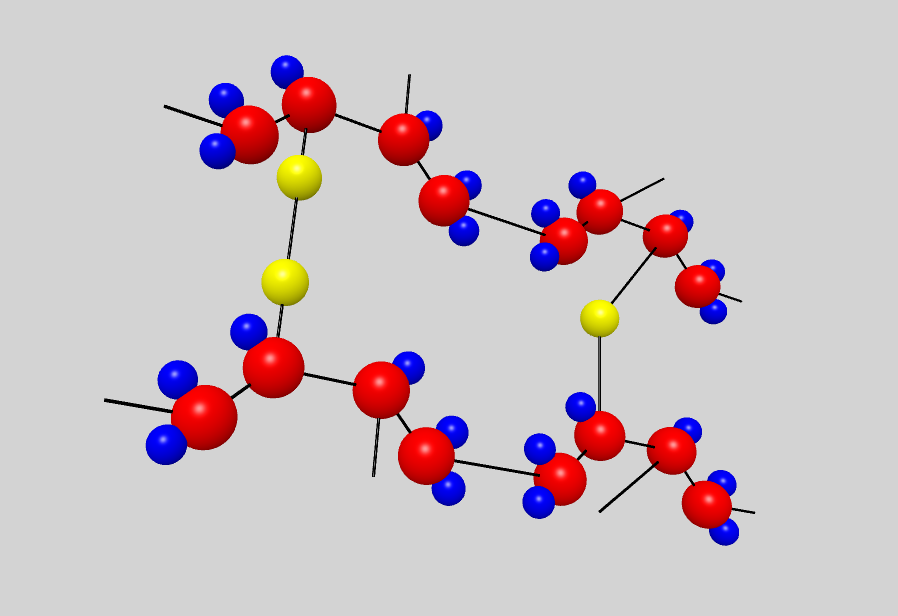

= Modélisation moléculaire des polymères avec SAW
Oxana USHAKOVA
:feelpp: Feel++
:stem: latexmath

== Polymères

Un polymères est une marcomolécule constitueé des la répétition des nombreuses monomères à liason covalente. Une chaîne contient typiquement stem:[10^3-10^5] monomères, et a la longeur de stem:[10^{-5} - 10^{-2}] cm.
La forme géometrique est aussi important que les propriétes chimiques.

== Vulcanisation 

Vulcanisation est un procédé chimique consistant à incorporer un agent vulcanisant (soufre) à un polymère pour former des ponts entre les chaînes molèculaires après la cuisson. Cette opération est largement utiliser dans le domaine de la production des pneu, car le polymère vulcanisé devient plus élastique et solide, moins plastique et moins dissoluble en dissolvants organiques.

Considèrons un 2-méthylbuta-1,3-diène polymérisé, autrement dit le caoutchouc naturel. Si on rajoute du soufre, après cuisson, on obtient un nouveau matériau qu'on utilise quotidiennement aujourd'hui. A l'echelle moléculaire on voit un réseau des monomères liés entre eux directement (comme le polymère d'avant) et par les molécules d'agent vulcanisant.

Voici un exemple avec le caoutchouc synthétique buta-1,3-diène polymérisé. 

On rajoute du soufre: 

Et après la cuisson on obtient le même réseau des atoms que avant:
 

Donc, quand on rajoute du soufre il prend un des doubles liens chez des polymères voisins et fait un espèce du pont. La longeur du pont, càd le nombre des atoms du soufre, varie aléatoirement de 1 à 8. 

  

Le soufre n'affect pas tous les monomères d'une molécule, même pas tous les molécules - les doubles liens affectés sont choisi aléatoirement. Mais en augementant la concentration du soufre à 30% on se retrouve dans le cas où tous les doubles liens sont pris par soufre et la longeur des pont n'excède 2 atomes : le matériau résultant est ébonite. La longeurs réduite des ponts s'explique par les condition de cuisson : aux temperatures exrtrêmes ( stem:[> 800°] ) le nombre des atomes dans une molécule de soufre diminue de 8 à 1-2. 

Pour simuler la vulcanisation en Mathis on va prendre 10 polymères de caoutchouc synthétique de longeur de 30 monomères. Donc ces polymères représentent les lignes horizontals sur une lattice de 80x30 (10*8=80, où 8 - la longeur du pont max). Le taux des doubles liens affectés va dépendre de la concenration du soufre. Les liens à affecter seront choisis aléatoirement, la longeur des ponts sera aussi aléatoire pour chaque pont. Un pont peut aller à 1 de 30 monomères du polymère voisin. Les atomes du soufre font marches aléatoires sans intersection entre les macromolécules, ce qu'on va simuler avec méthodes statiques.

Création grille d'affichage:

x-atome C stable (ne peut pas interagir avec soufre)
o-atome C à double lien (peut être affecté par soufre)

Exemple de 4 polymères:

xxooxxooxxoo
xooxxooxxoox
ooxxooxxooxx
oxxooxxooxxo

Partie constant : xxoo

Il existe 4 débuts des chaines possibles:

. xxoo_n
. oo + xxoo_n
. o + xxoo_n
. x + oo + xxoo_n

Donc, morceau xxoo est un "incrément constant", et oo,o,x sont utilisés qu'au début.

Puis, on crée ces 4 types des chaines et on les met en ordre aléatoire, l'une après l'autre,  en fonction de la hauteur du grille qu'on veut (4,8,12, etc) 

COORDONNEES VERTICES:
 

=== Self-avoiding walks (SAW) et Chaînes de Markov

On appele une SAW ("Self-avoiding walk") une marche des points toutes distincts dans une lattice à dimension stem:[d]. Ce modèle a été créé spécialement pour simuler des polymères linéaires dans un dissolvant il y 50 ans.
Sous la condition que la distance entre les points voisins est constante, on a stem:[2d] pas possibles à chaque étape. Si de plus on suppose, que la marche ne peut pas revenir en arrière, on a stem:[2d-1] pas possible à chaque étape sauf le premier (stem:[2d]).

La fonction de partition qui donne l'iformation su l'efficacité des marches générées de longeur stem:[N] peut être écrite comme :

* fonction de partition

stem:[ <Z(N)>_{ss}=\frac{nb-marches-acceptée}{nb-des-simulations}]

* fonction de partition pour les marches "poindérés"

stem:[ Z_{bs}=\frac{\sum_{toutes-les-marches}W_{marche}}{nb des simulations}=<W>]

Pour les méthodes statiques, la fonction de partition est de la forme:

stem:[Z_N=C exp (-\lambda N)N^{\gamma-1}] avec

* stem:[C] - constante de normalisation
* stem:[\lambda] - attrition constant
* stem:[\gamma] - critical exponent (ne dépend pas du modèle)

=== Objectifs et méthodes

=== Bibliographie et Outils Informatiques
%%%%%%%%%%%%%%%%%%%%%%%%%%%
== Algorithmes

=== Algorithmes statiques (SAW)

Les algorithmes dynamiques se basent sur SAW, autrement dit l'itération stem:[n] ne dépend pas de stem:[\sum_0^{n-1}].

==== Simple Sampling

. Se mettre à l'origine du polymère
. Générer le premier pas aléatoirement/Choisir le premier pas arbitrairement
. Choisir aléatoirement un des stem:[2d-1] pas
. Si la marche générée s'intersecte, on la rejète et commence dès le début - étape 1
. Si la marche générée nous convient, on rajoute ce pas dans la marche
. Si la marche générée est de longeur souhaitée,on accepte la marche. Sinon, on revient vers étape 3.
. Répéter jusqu'à la marche soit de la longeur souhaitée.

===== _Avantages_
* Facile à programmer
* Pas de bias : toutes configurations sont possibles

===== _Disavantages_
* Pas efficace pour des chaînes longues dans petites dimensions car la taux du rejet devient trop élévé.

==== Biased Sampling (Méthode de Rosenbluth)
. Se mettre à l'origine du polymère
. Générer le premier pas aléatoirement/Choisir le premier pas arbitrairement
. Trouver tous les pas qui ne donne pas l'intersection
. Si il n'y a pas de tels pas - on met le poids stem:[\omega=0], on rejète la marche générée et on revient vers le début - étape 2. Sinon on ajoute ce pas à la marche et recalculont le poids stem:[\omega].
. Si la marche générée est de longeur souhaitée, on accepte la marche et on calcule le poids total. Sinon, on revient vers étape 3.
. Répéter jusqu'à la marche soit de la longeur souhaitée

===== _Avantages_
* Pas difficile à programmer
* Beaucoup plus efficace que l'algorithme précedent
* Pas de bias : toutes configurations sont possibles

===== _Disavantages_
* Pas efficace pour des chaînes trop longues dans petites dimensions car la taux du rejet devient trop élévé.

=== Algorithmes dynamiques (Chaînes de Markov)

Les algorithmes statiques se basent sur les chaînes de Markov, autrement dit l'itération stem:[n] ne dépend que de stem:[n-1].

==== Algorithme de Reptation 

. Générer ou chisir un SAW à n pas
. Choisir une fin aléatoirement et la retirer
. Choisir aléatoirement un des stem:[2d-1] pas possibles de l'autre côté
. Si ce pas donne l'intersection, on revient à l'arrière et considère  cette configuration comme nouvelle
. Si ce pas ne donne pas de l'intersection,   on considère cette configuration comme nouvelle
. On revient à l'étape 2 jusqu'à on a la longeur  souhaitée de la marche

===== _Avantages_
* Très efficace
* Chaque itération ne demande que un peu de calcul
 
===== _Disavantages_
* Pas intuitive
* Le résultat dépend de l'origine, de la condition initiale
* Bias : il y a des configuration qu'on ne peut jamais obtenir

==== Algorithme de pivot

. Générer ou chisir un SAW à n pas
. Choisir aléatoirement un pivot sur la marche. Ce pivot divise la marche en deux
. Choisir aléatoirement une des deux sous-marches
. Choisir aléatoirement un opération symétrique et l'appliquer à la sous-marche
. Si cette opération donne l'intersection, on revient à l'arrière et considère  cette configuration comme nouvelle
. Si cette opération ne donne pas de l'intersection,   on considère cette configuration comme nouvelle
. On revient à l'étape 2 jusqu'à on a la longeur  souhaitée de la marche

===== _Avantages_
* Converge vite
* Pas de bias : toutes configurations sont possibles 

===== _Disavantages_
* Chaque itération demande beaucoup de calcul
* Difficile à implémenter à l'ordinateur : nombres des symétries augement très vite
* Pas trop efficace pour des chaînes longues, mais converge toujours aussi vite 

